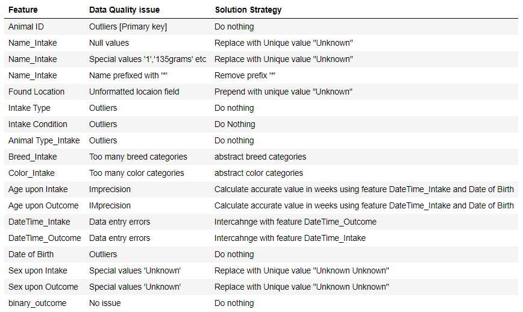
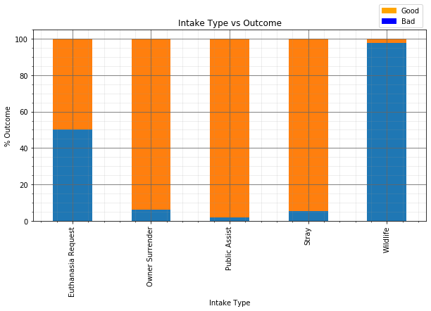

# EDA-Animal-Shelter
Exploratory Data Analytics of Texas Animal Shelter data and Performance analysis of ML algorithms

## This analysis solves a prediction problem: Whether enrolled animal in Texas Animal Shelter shall live or not.

## EDA stage

### Data Quality plan 
* Summary of feature transforms
* [Data Quality report](https://github.com/RasikKane/EDA-Animal-Shelter/blob/master/Data_Quality_Plan.pdf) is made to record analysis
 

### Preprocessing
* Datetime parameters are discretized. All parameters are standardized in terms of weeks.
* Once data integrity checks are passed, cardinality of few categorical features is reduced using **data wrangling**. For example -
   * "Orange Tabby/White" and "Orange Tabby/cream" is treated as --->  "Orange Tabby" etc.
   * "Pit Bull/Australian Cattle Dog" is treated as --->  "Pit Bull" etc.

### Engineered Features
**4 new sets of features are engineered.** For example -
* Wild animals were found to be more susceptible, so recidence_time_ratio feature was used
 

   <!-- $Target\ Variable\ \alpha\  \frac{Time\ in\ Outer\ World}{Time\ in\ Shelter}$ -->   
* "Found Location" was split into "found_Address_Line1", "found_Address_City" and"found_Address_State"

## Machine Learning Stage
In this stage, performance of ML algorithms as well as correaltion of specific set of features on outputs is tested to Fine tune a Random forest model. 
**chi squared test** 
* Entire feature space is categorical for this problem. So, features selected in prior stages by visual inspections are statistically validated

**After 3-fold cross - validation of Linear Regression, Logistic Regression and Random Forest models, following results were achieved: **
Results for old model with top20 optimal features:

==============================================================================
Accuracy:  0.95
Confusion matrix: 
 [[ 49  48]
 [  2 901]]
Classification report:
                precision    recall  f1-score   support

         0.0       0.96      0.51      0.66        97
         1.0       0.95      1.00      0.97       903

    accuracy                           0.95      1000
   macro avg       0.96      0.75      0.82      1000
weighted avg       0.95      0.95      0.94      1000

Results for new model with top20 optimal features available in new data :

==============================================================================
Accuracy:  0.958
Confusion matrix: 
 [[134  41]
 [  1 824]]
Classification report:
                precision    recall  f1-score   support

         0.0       0.99      0.77      0.86       175
         1.0       0.95      1.00      0.98       825

    accuracy                           0.96      1000
   macro avg       0.97      0.88      0.92      1000
weighted avg       0.96      0.96      0.96      1000
